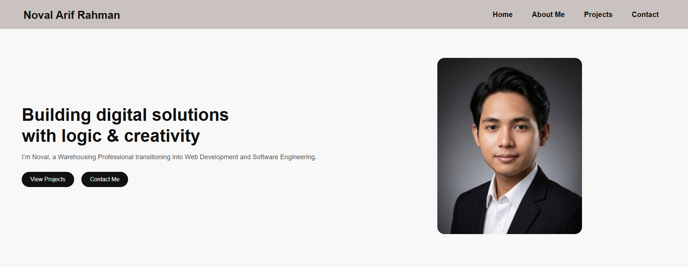
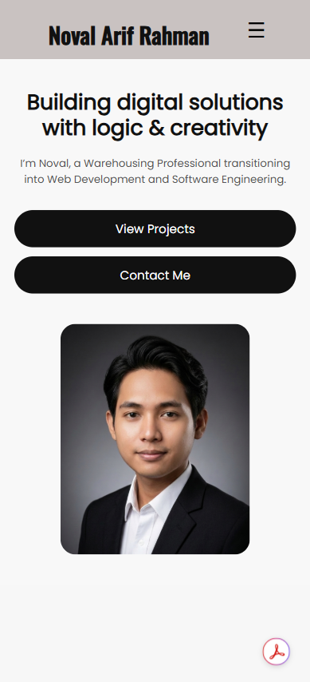
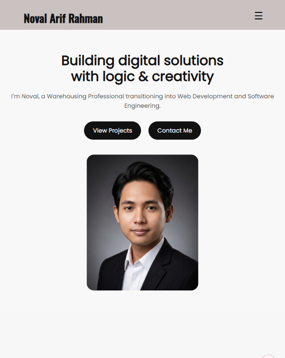

# Personal Portfolio Website

This is my personal portfolio website, created to showcase my profile, work experience, and projects as I transition into Web Development and Software Engineering.


---

## 🚀 Live Demo

You can access the website here:  
👉 https://revou-fsse-feb26.github.io/milestone-1-nofalariff/

---

## 📌 Features

- Responsive Hero Section with Call-To-Action (CTA)
- Navigation Bar with internal links (smooth section navigation)
- About Me section with education & work experience
- Projects section with project cards
- Contact form with:
  - Input fields (name, email, message)
  - Submit button
  - Reset button
- Semantic HTML structure
- Clean and simple CSS layout
- Image integration using `<figure>` and ``
- Organized content using Flexbox (CSS layout)

---

## 🛠️ Technologies Used

- HTML5 (Semantic HTML)
- CSS3 (Layouting and Styling)

---

## 📂 Website Structure

### 🏠 Home Section

Displays a short introduction and main navigation:

- Hero headline
- Short description
- Call-to-action buttons (View Projects & Contact)

### 👤 About Me Section

Provides detailed information about:

- Personal background
- Education history
- Work experience
- Interests

### 💼 Projects Section

Showcases my work through project cards, including:

- Project title
- Description
- Image preview

### 📬 Contact Section

Includes a contact form where visitors can:

- Enter their name, email, and message
- Submit or reset the form

---

## ⚙️ How to Run the Project

1. Clone this repository:
   ```bash
   git clone https://github.com/Revou-FSSE-Feb26/milestone-1-nofalariff.git
   ```

---

## 📈 Feature Improvements for Assignment 2

- Add Responsive CSS media queries for Tablet and Mobile
- JavaScript Interactivity on Navigation Hamburger menu
- Add Transition in Card Projects

---

## Display on Mobile



## Display on Tablet


